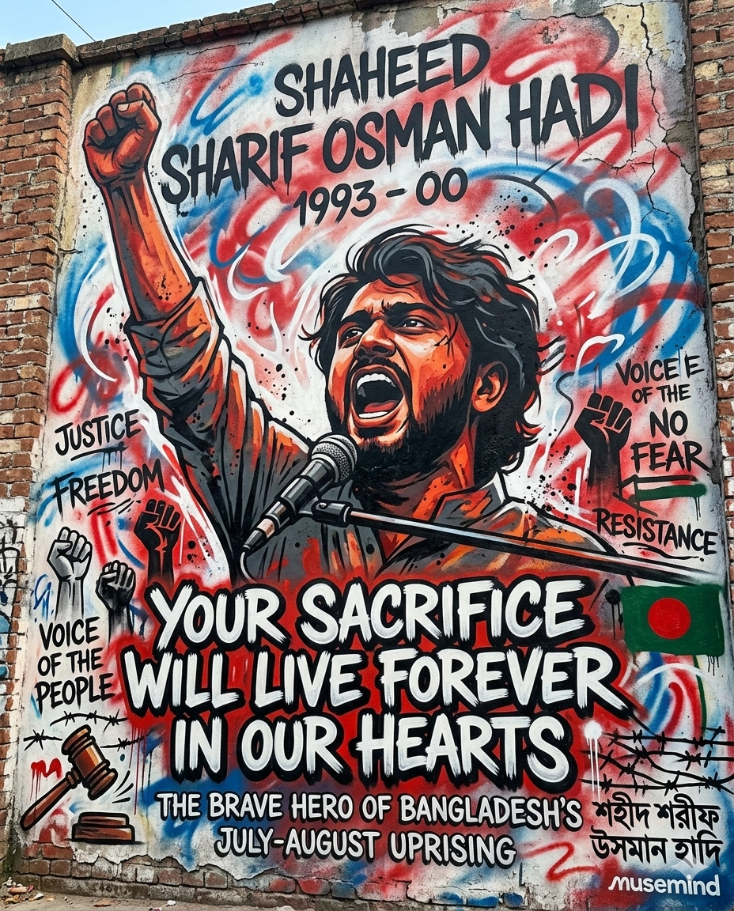

  

<h1 align="center">👋 Hey, I'm Sazzad Hossain</h1>

  

<h3 align="center">Full Stack Developer | Laravel & JavaScript Specialist | AI Enthusiast</h3>

  <i>"I HAVE NO SPECIAL TALENTS. I AM ONLY PASSIONATELY CURIOUS."</i>

---

### 🚀 About Me

I am a **Full Stack Developer** dedicated to building high-performance, scalable applications. My expertise lies in the **Laravel Ecosystem**, **modern JavaScript**, and **AI Engineering**. I enjoy architecting clean, maintainable systems and exploring the frontiers of automation.

I am also the founder of **[ZenGfy](https://zengfy.top)**, an expanding SaaS ecosystem built with modular multi-service architecture integrating E-commerce, School ERP, Hotel Management, and AI-powered tools.

---

### 🛠️ Tech Stack

  
  
  
  
  
  
  
  
  
  

---

### 💼 Professional Experience

- **🚀 Full Stack Developer @ Raw Axiom** (Remote, Toronto) | *Nov 2025 – Present*
  - Scaling REST APIs and dynamic frontends for global clients.
- **💡 Founder & Developer @ ZenGfy** | *2023 – Present*
  - Architecting a multi-service SaaS ecosystem (E-commerce, ERP, AI Tools).

---

### ✨ Featured Projects

- 🛠️ **[ZenGfy](https://zengfy.top)**: Multi-service modular SaaS platform.
- 📊 **[Algorithms Visualization](https://github.com/diusazzad/algorithms_visualization)**: Interactive tool for learning algorithms.
- 🗺️ **[LaravelDoc](https://github.com/diusazzad/laraveldoc)**: A comprehensive learning roadmap for Laravel.

---

### 📊 Vital Stats

  
  
  

  

---

### 🌍 Connect With Me

  
  
  
  

